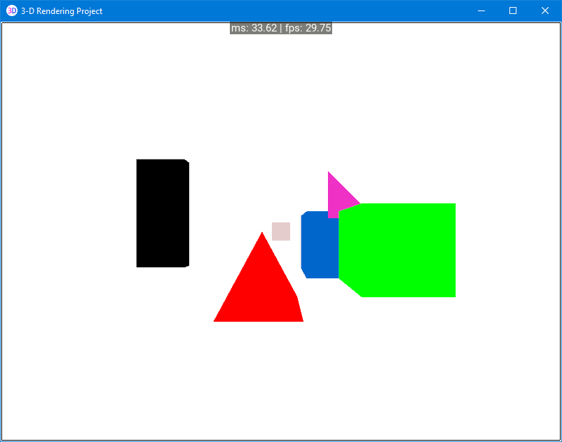

3D Rendering
============

Program for rudimentary three dimensional rendering and editing.
Refactor of my 3D Rendering project using Kivy.

Features
--------
- View widget that displays 3D shapes
- Console widget that executes functions from text input
- DebugOverlay widget for outputting debug text information
- Key bindings that can be rebound in the settings tab of the menu

TODO
----
- Refine View widget
- Complete Console widget
- Complete DebugOverlay widget
- Implement key binding system

----

**Started: April 9th 2017**
